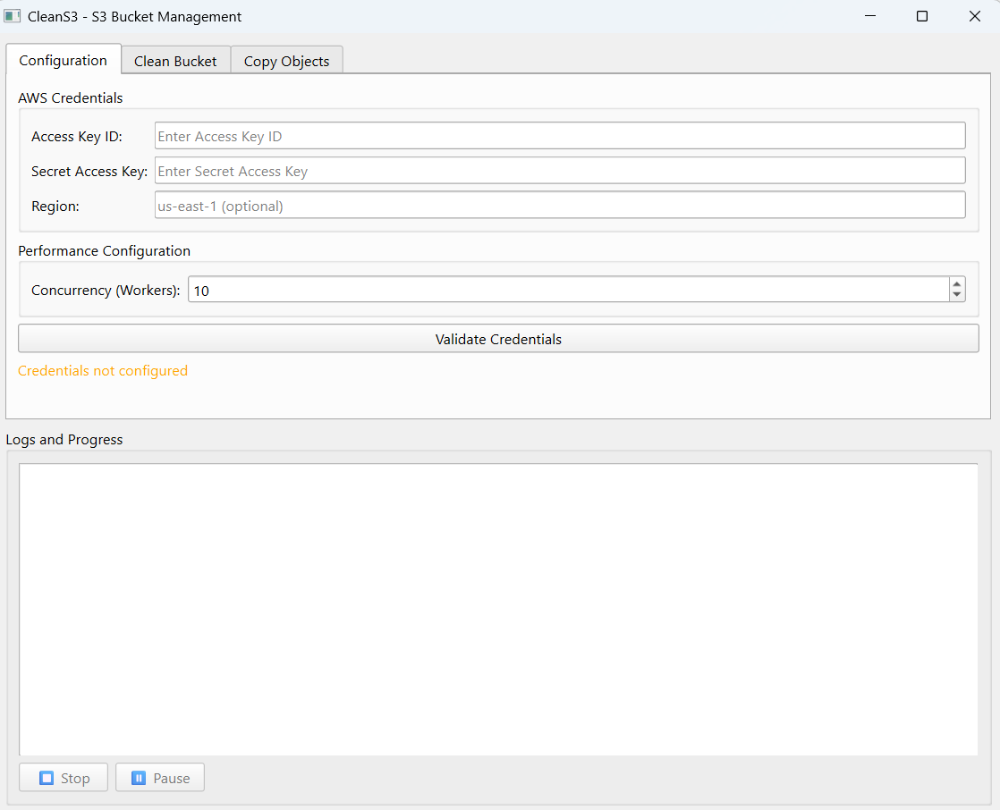

# CleanS3 🧹

<div align="center">


**A powerful desktop application for managing AWS S3 buckets with an intuitive graphical interface**

[Features](#-features) • [Installation](#-installation) • [Usage](#-usage) • [Requirements](#-requirements)

</div>

---

## 📋 Table of Contents

- [Overview](#-overview)
- [Features](#-features)
- [Screenshots](#-screenshots)
- [Requirements](#-requirements)
- [Installation](#-installation)
- [Usage](#-usage)
- [Configuration](#-configuration)
- [Security](#-security)
- [Troubleshooting](#-troubleshooting)
- [Contributing](#-contributing)
- [License](#-license)

## 🎯 Overview

CleanS3 is a desktop application built with PyQt6 that provides a user-friendly interface for managing AWS S3 buckets. It allows you to efficiently clean buckets and copy objects between buckets with advanced features like concurrent operations, progress tracking, and pause/resume functionality.

**✨ Special Feature**: CleanS3 fully supports **versioned S3 buckets**. When cleaning a versioned bucket, the application automatically detects versioning and removes all object versions and delete markers, ensuring a complete cleanup.

### Key Highlights

- 🚀 **High Performance**: Concurrent operations with configurable worker threads
- 🎨 **Modern UI**: Clean and intuitive PyQt6 interface
- ⏸️ **Pause/Resume**: Control long-running operations
- 📊 **Real-time Progress**: Live updates on operation status
- 🔒 **Secure**: Credentials are handled securely and never stored
- 🪣 **Smart Bucket Management**: Automatic bucket discovery with autocomplete
- 🔄 **Versioned Bucket Support**: Fully supports S3 versioned buckets (deletes all versions and delete markers)

## ✨ Features

### Clean Bucket
- Delete all objects from an S3 bucket
- **Full versioned bucket support**: Automatically detects and handles versioned buckets
  - Deletes all object versions
  - Removes all delete markers
  - Ensures complete bucket cleanup
- Concurrent deletion for improved performance
- Progress tracking with detailed logs

### Copy Objects
- Copy objects between S3 buckets
- Support for source and destination path prefixes
- Concurrent copying with configurable concurrency
- Real-time progress updates

### Additional Features
- **Credential Management**: Secure AWS credential validation
- **Bucket Autocomplete**: Quick bucket selection with search
- **Operation Control**: Pause, resume, and cancel operations
- **Performance Tuning**: Adjustable concurrency (1-100 workers)
- **Comprehensive Logging**: Detailed operation logs

## 📸 Screenshots

### Main Application Window



The CleanS3 application features a clean and intuitive interface with three main tabs:

- **Configuration Tab**: Manage AWS credentials and performance settings
- **Clean Bucket Tab**: Delete all objects from an S3 bucket
- **Copy Objects Tab**: Copy objects between S3 buckets

The application includes real-time progress tracking, operation controls (pause/stop), and comprehensive logging.

## 📦 Requirements

- **Python**: 3.8 or higher
- **AWS Credentials**: IAM user with appropriate S3 permissions
- **Dependencies**: See `requirements.txt`

### Required IAM Permissions

The following IAM permissions are required:

| Permission | Purpose |
|------------|---------|
| `s3:ListBucket` | List buckets and objects |
| `s3:ListBucketVersions` | List object versions (for versioned buckets) |
| `s3:DeleteObject` | Delete objects |
| `s3:DeleteObjectVersion` | Delete object versions |
| `s3:GetObject` | Read objects (for copying) |
| `s3:PutObject` | Write objects (for copying) |

## 🚀 Installation

### Prerequisites

Ensure you have Python 3.8+ installed:

```bash
python --version
```

### Step 1: Clone the Repository

```bash
git clone https://github.com/yourusername/CleanS3.git
cd CleanS3
```

### Step 2: Install Dependencies

```bash
pip install -r requirements.txt
```

### Step 3: Run the Application

```bash
python main.py
```

## 💻 Usage

### Initial Setup

1. **Launch the application**
   ```bash
   python main.py
   ```

2. **Configure AWS Credentials**
   - Navigate to the **Configuration** tab
   - Enter your AWS Access Key ID
   - Enter your AWS Secret Access Key
   - Optionally specify your AWS Region (defaults to us-east-1)
   - Click **Validate Credentials** to test the connection

3. **Configure Performance Settings**
   - Adjust the **Concurrency (Workers)** value (1-100)
   - Higher values = faster operations but more AWS load
   - Recommended: 10-20 for most use cases

### Cleaning a Bucket

1. Navigate to the **Clean Bucket** tab
2. Enter or search for the bucket name (autocomplete available)
3. Click **Clean Bucket**
4. Confirm the operation in the warning dialog
5. Monitor progress in the logs area
6. Use **Pause** or **Stop** buttons to control the operation

> ⚠️ **WARNING**: This operation is **DESTRUCTIVE** and **cannot be undone**. All objects and versions will be permanently deleted.

#### Versioned Buckets

CleanS3 automatically handles versioned buckets:
- **Automatic Detection**: The application detects if a bucket has versioning enabled
- **Complete Cleanup**: Deletes all object versions and delete markers
- **Progress Tracking**: Shows detailed progress for versioned bucket operations
- **No Manual Configuration**: Works seamlessly with both versioned and non-versioned buckets

### Copying Objects

1. Navigate to the **Copy Objects** tab
2. Enter the **Source Bucket** name
3. Optionally specify a **Source Path** prefix
4. Enter the **Destination Bucket** name
5. Optionally specify a **Destination Path** prefix
6. Click **Copy Objects**
7. Confirm the operation
8. Monitor progress in the logs area

## ⚙️ Configuration

### Concurrency Settings

The application allows you to configure the number of concurrent operations:

- **Low (1-5)**: Safe for rate-limited accounts, slower but more reliable
- **Medium (10-20)**: Recommended for most use cases
- **High (50-100)**: Fast but may hit AWS rate limits or increase costs

### Region Configuration

If you don't specify a region, the application will use the default region for your AWS account. For better performance, specify the region where your buckets are located.

## 🔒 Security

- **No Credential Storage**: Credentials are only stored in memory during the session
- **Secure Validation**: Credentials are validated before use
- **No Network Logging**: Credentials are never logged or transmitted unnecessarily
- **Local Processing**: All operations run locally on your machine

### Best Practices

- Use IAM users with minimal required permissions
- Rotate credentials regularly
- Never commit credentials to version control
- Use AWS IAM roles when possible (for EC2 instances)

## 🐛 Troubleshooting

### Common Issues

**Problem**: "Credentials not configured" error
- **Solution**: Ensure you've entered and validated credentials in the Configuration tab

**Problem**: "Bucket does not exist or is not accessible"
- **Solution**: Verify the bucket name and ensure your IAM user has `s3:ListBucket` permission

**Problem**: Operation is slow
- **Solution**: Increase the concurrency value in Configuration (be mindful of AWS rate limits)

**Problem**: "Connection error"
- **Solution**: Check your internet connection and AWS service status

### Getting Help

If you encounter issues:

1. Check the logs area for detailed error messages
2. Verify your IAM permissions
3. Ensure your AWS credentials are valid
4. Check AWS service status at [status.aws.amazon.com](https://status.aws.amazon.com)

## 🤝 Contributing

Contributions are welcome! Please feel free to submit a Pull Request.

1. Fork the repository
2. Create your feature branch (`git checkout -b feature/AmazingFeature`)
3. Commit your changes (`git commit -m 'Add some AmazingFeature'`)
4. Push to the branch (`git push origin feature/AmazingFeature`)
5. Open a Pull Request

### Development Setup

```bash
# Clone the repository
git clone https://github.com/yourusername/CleanS3.git
cd CleanS3

# Install development dependencies
pip install -r requirements.txt

# Run the application
python main.py
```

## 📄 License

This project is licensed under the MIT License - see the [LICENSE](LICENSE) file for details.

## 🙏 Acknowledgments

- Built with [PyQt6](https://www.riverbankcomputing.com/software/pyqt/)
- AWS integration powered by [boto3](https://boto3.amazonaws.com/)
- Icons and UI elements from standard PyQt6 components

---

<div align="center">

**Made with ❤️ for the AWS community**

⭐ Star this repo if you find it useful!

[Report Bug](https://github.com/coviedo1989/CleanS3/issues) • [Request Feature](https://github.com/coviedo1989/CleanS3/issues) • [Documentation](https://github.com/coviedo1989/CleanS3/wiki)

</div>


